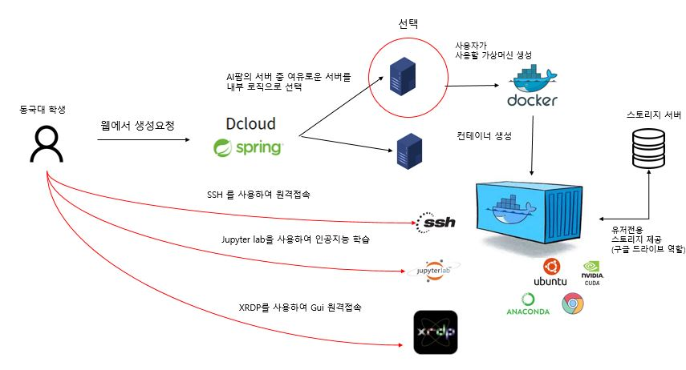
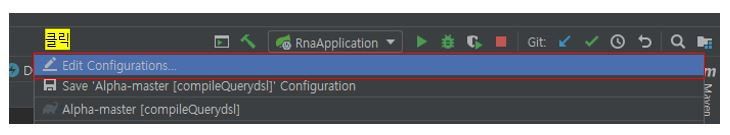
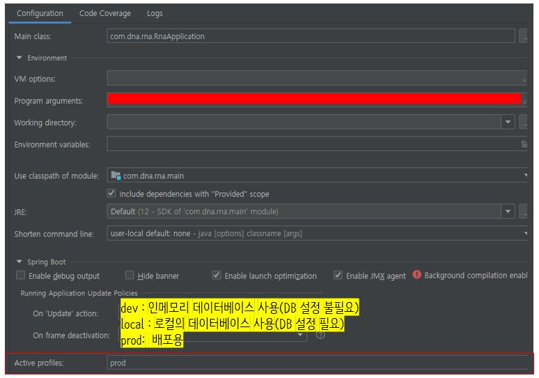

## Dcloud

### Introduction

동국대학교 고등인공지능연구원내의 On-Premise 서버들을 클라우드처럼 제공하는 프로젝트입니다
GPU 자원제공과 더불어 내부 스토리지 서버와 연동되어 클라우드 드라이브의 서비스도 제공합니다.

사용 가이드 영상 : https://youtu.be/KJKfLglNm1Y

### Architecture

### Build Environment
Java 12 이상

Gradle 6.0.1 이상

### Build Instruction
$ git clone https://github.com/DGU-AILab/Alpha

$ cd Alpha

윈도우 환경

$ gradlew build -x test

리눅스 환경  

$ ./gradlew build -x test

### Intellij IDEA 에서 실행 가이드

1. 프로젝트 Import(gradle 프로젝트로)

2. Edit Configuration

3. Profile 수정

### Contribution

1. 저장소 fork

2. develop 브랜치에서 작업 후 pull request

3. pull request 리뷰

